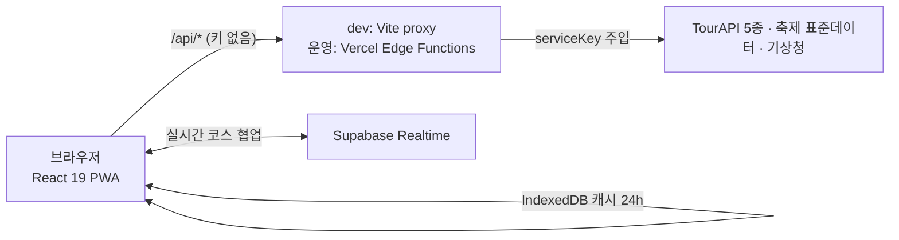

# 쉼(休)마루 · Shimmaru

> 경상북도 전통문화 여행 코스 추천 PWA · **2026 관광데이터 활용 공모전(웹·앱 개발 부문)** 출품작

한옥·서원·사찰·전통체험·전통시장·향토축제를 한 흐름으로 잇는 다국어(한·영·일·중) 모바일 퍼스트 웹앱.
**챗봇에 지역·기간·동반자·취향만 답하면**, 실제 관광 데이터에 근거해 동선까지 최적화한 코스를 자동 생성합니다.


---

## 지역특화 — 왜 경상북도인가
22개 시군. 안동·경주 같은 대표 도시부터 봉화·영양·청송 같은 한적한 내륙까지 전통문화 자원 밀도가 전국 최고지만 방문은 특정 지역에 쏠립니다. 쉼마루는 **숨은 시군을 데이터로 끌어올리는 것**을 핵심 가치로 삼습니다.

## 한국관광공사 OpenAPI 활용
단순 목록 조회를 넘어 **데이터를 조합·재가공**합니다.

| 구분 | 서비스 | 활용 |
| --- | --- | --- |
| 관광정보(국·영·일·중) | `KorService2` 외 | 장소·검색·주변·상세·갤러리, 4개 언어 자동 전환 |
| 무장애 여행 | `KorWithService2` | 휠체어·유모차 등 접근성 코스 |
| 반려동물 동반여행 | `KorPetTourService` | 반려동물 동반 가능 장소로 코스 구성 |
| 연관 추천(빅데이터) | `TarRlteService` | "함께 찾은 곳" — 실제 동반 방문 패턴 추천 |
| 데이터랩(빅데이터) | `DataLabService` | 시군별 방문자 통계 대시보드(`/insights`) |
| 행사·축제 | 행안부 문화축제 표준데이터 + TourAPI 이미지 | 진행/예정/종료 캘린더 |

> 빅데이터·무장애·반려동물 서비스는 같은 인증키로 **무료 추가 활용신청**만 하면 켜집니다.
> 미신청이어도 앱은 정상 동작(graceful 폴백)하며, 가짜/목업 데이터는 쓰지 않습니다.

## 핵심 기능
- **코스 자동 생성 엔진** — 카테고리 가중치 × 거점 반경 × 숨은지역 보너스(데이터랩 실방문자) × 동반자 가중치 × 강수 경향(기상청 단기예보)으로 점수화 → 2-opt 동선 최적화.
- **축제 연계** — 거점 지역·여행 기간에 열리는 축제만 코스에 연결.
- **함께 찾은 곳 / 경북 데이터 인사이트(`/insights`)** — 빅데이터 기반 연관 추천·방문자 랭킹.
- **다국어 + PWA** — 4개 언어, 오프라인 폴백, 홈 화면 추가.

## 기술 스택
React 19 · TypeScript · Vite 7 · Tailwind · Zustand · React Router · i18next · Kakao Map SDK · vite-plugin-pwa.
API 키는 프론트에 노출하지 않습니다 — dev는 Vite 프록시, 운영은 Vercel Edge Function이 `serviceKey`를 주입.

## 아키텍처



설계에서 중요하게 다룬 결정들:

- **dev/운영 대칭 API 게이트웨이** — 프론트는 항상 `/api/*`만 호출. 키는 서버 측에서만 주입되고, 환경 분기 코드가 서비스 계층에 없다.
- **통합 프록시 + 요청 배칭** — 외부 API 4종(TourAPI·축제 표준데이터·기상청·템플스테이)은 `api/proxy.ts` 하나가 서비스 테이블로 처리하고, dev 미들웨어도 같은 함수를 호출한다. TourAPI 는 `?path=` 기반이라 별도 활용신청이 필요한 API(빅데이터·반려동물)가 승인되면 코드 수정 없이 활성화. 코스 생성의 시군×카테고리 검색 15~20회는 `/api/tour-batch` 한 번으로 묶어 보낸다.
- **목업 없는 graceful 폴백** — API 미신청/실패 시 해당 기능만 숨기거나 대체 데이터(기상청 실패 → 평년 강수 경향)로 전환. 가짜 데이터는 쓰지 않는다.
- **장소 데이터 적재 + DB 우선 조회** — `api/sync-places.ts`(Vercel Cron, 일 1회)가 경북 22개 시군의 TourAPI 장소를 Supabase `tour_places`에 적재하고, 프록시가 동기화된 시군의 검색을 DB에서 TourAPI와 같은 형태로 응답. 미동기화·DB 미설정이면 그대로 포워딩되어 부분 적재 상태도 안전. 스키마는 `supabase/migrations/`.
- **서버 코스 생성 + 저장** — `POST /api/course`가 적재된 DB 후보로 프런트와 같은 엔진 파일을 서버에서 실행해 코스를 통째로 돌려주고, `/api/courses`가 저장 코스를 보관(익명 클라이언트 id 단위). 서버가 준비되지 않으면 503 `not-ready`로 알려 클라이언트가 예전 로컬 파이프라인으로 폴백한다.
- **이중 캐시** — 클라이언트 IndexedDB(TTL 24h) + Edge `s-maxage` CDN 캐시. 빈/에러 응답은 캐시하지 않아 일시 장애가 굳지 않게 함.
- **로그인 없는 실시간 협업** — 방 코드(GB-XXXXX)를 키로 Supabase Realtime 동기화, 버전 기반 LWW + union 병합.

→ 코스 생성 엔진(가중치 점수화 · quota · 2-opt)을 포함한 상세는 **[doc/ARCHITECTURE.md](doc/ARCHITECTURE.md)**

## 품질 관리 & 트러블슈팅

회차별 정형 QA 리포트(`doc/품질테스트_*.md`, 9건)로 관리 — tsc/eslint/build 정적 게이트 + OpenAPI 실호출 검증 + 이전 지적사항 재검증. 결함은 심각도·파일:라인 단위로 기록합니다. 기억에 남는 사례:

- **총거리 8,900km 코스 버그** — 좌표 누락 축제가 `(0,0)`(Null Island)으로 들어와 동선이 대서양까지 이탈. 엔진 진입 전 좌표 가드를 표준화. ([기록](doc/품질테스트_20260612_1043.md))
- **죽은 폴백 코드** — axios `validateStatus` 미설정으로 4xx 응답이 즉시 throw되어, "빅데이터 미신청" 안내 분기가 한 번도 실행되지 않던 문제.
- **빌드 차단 타입 결함** — 검색 recall 개선 중 타입 미선언 필드 사용으로 `tsc -b` 실패 → 운영 빌드 전체 차단. QA 게이트에서 발견·즉시 수정. ([기록](doc/품질테스트_20260629_1441.md))

## 로컬 실행
```bash
cd frontend
cp .env.example .env.local   # TOUR_API_KEY, VITE_KAKAO_MAP_KEY 입력
npm install
npm run dev                  # http://localhost:5173 (Kakao 콘솔에 5173 등록 필요)
```

## 배포
Vercel 환경변수에 `TOUR_API_KEY`, `FESTIVAL_STD_API_KEY` 설정 → `frontend` 디렉터리 빌드.
