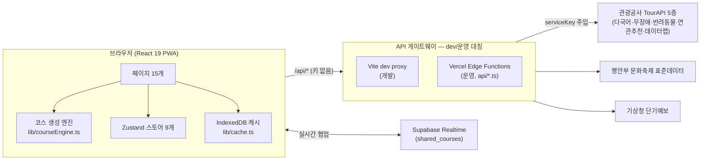

# 쉼(休)마루 아키텍처

> 설계 의사결정과 그 이유를 기록한 문서입니다. 전체 소개는 [루트 README](../README.md), 개발 환경 온보딩은 [frontend/README.md](../frontend/README.md) 참고.

## 시스템 개요

## 1. API 계층 — dev/운영 대칭 구조

**결정: 프론트 코드는 항상 `/api/*`만 호출하고, dev와 운영의 차이를 모르게 한다.**

- 개발: `vite.config.ts`의 dev proxy가 `serviceKey`를 주입해 공공데이터포털로 포워딩
- 운영: 같은 인터페이스의 Vercel Edge Function(`api/*.ts`)이 응답

이유 — API 키를 번들에 넣지 않으면서(`TOUR_API_KEY`는 `VITE_` 접두사가 없어 브라우저에 노출되지 않음), 환경 분기 코드를 서비스 계층에서 제거하기 위해. 브라우저에 노출되는 키는 도메인 화이트리스트로 보호되는 `VITE_KAKAO_MAP_KEY` 하나뿐이다.

**결정: `api/tour.ts`는 `?path=` 쿼리 기반 범용 포워더로 만든다.**

TourAPI 계열(B551011) 하위의 어떤 서비스든 경로만 넘기면 포워딩된다. 빅데이터·반려동물 등 별도 활용신청이 필요한 서비스는 승인되는 순간 **코드 수정 없이** 활성화된다. `vercel.json` rewrites가 `/api/tour/:path*` → `/api/tour?path=:path*`로 변환.

**결정: 목업 데이터를 쓰지 않는다 — 실패는 빈 결과 + graceful 폴백으로.**

- 빅데이터 API 미신청 → `not-subscribed` 분류 후 해당 기능만 숨김
- 기상청 예보 실패/범위 초과 → 30년 평년 월별 강수 경향으로 대체
- 에러는 `TourApiError`로 정규화하고 `network / forbidden / noKey / unknown`으로 분류

## 2. 코스 생성 엔진 (`frontend/src/lib/courseEngine.ts`)

파이프라인: **점수화 → 카테고리 다양성 슬롯(quota) → 시군구 클러스터 NN 정렬 → 2-opt 동선 최적화 → 거리/시간 계산**

### 점수화 — 가중치 곱셈 체인

`scoreOf()`는 카테고리 기본 가중치에 아래 요소를 순차적으로 곱한다:

| 요소 | 동작 | 예시 |
|---|---|---|
| 취향 프로필 | `PROFILE_WEIGHTS[profile][category]`, 멀티 프로필은 카테고리별 max 병합 | 한옥감성 프로필: hanok ×2.0 |
| 동반자 | 가점은 max, 감점은 min으로 병합 | 아이 동반: 체험 ×1.4, 서원 ×0.7 / 반려동물: 사찰 ×0.55 |
| 무장애 모드 | 접근성 정보 보유 ×1.6, 미보유 ×0.85 | |
| 찜한 장소 | ×2.5 | |
| 숨은지역 보너스 | 데이터랩 실방문자 통계 우선, 없으면 정적 시군별 보너스 | 숨은경북 프로필: hiddenAreaBonus 1.5 |
| 날씨 | 강수 가능성 높으면 실내 가점(체험 ×1.4), 야외 감점(트레일 ×0.5) | 기상청 POP 기반 |
| 거점 이탈/반경 | 기간별 프로필로 감점 (당일 ×0.15 ~ 2박3일 ×0.65), 반경 초과 시 선형 감점 | |

기간별 파라미터(`DURATION_PROFILE`): 당일 4곳/반경 25km, 1박2일 6곳/50km, 2박3일 8곳/80km. 하드컷 거리 초과 후보는 풀에서 제외하되, 후보가 부족하면 원본으로 폴백.

### 다양성과 동선

- **quota** — 점수 순으로만 뽑으면 같은 카테고리로 쏠리므로, 프로필·동반자별 최소 슬롯을 보장 (예: 반려동물 동반 → 트레일 슬롯 확보). 여행 기간과 겹치는 축제는 거점 최근접 1개를 예약 삽입.
- **클러스터 NN** — 거점 시군구가 여러 개면 시군구 단위로 묶어 지역 간 점프를 최소화하고, 클러스터 내부는 nearest-neighbor 정렬.
- **2-opt** — NN 결과의 교차 동선을 구간 뒤집기로 개선. 거점 출발 열린 경로 기준, 60회 반복 상한.

### 협업 파생 연산

`recomputeCourse`(순서 유지, 거리만 갱신) / `reoptimizeCourse`(재최적화) / `mergeCourses`(두 코스 union 후 재최적화) — 실시간 협업의 병합 단위로 사용.

## 3. 캐싱 전략 — 이중 캐시

| 층 | 수단 | TTL |
|---|---|---|
| 클라이언트 | IndexedDB (`cachedFetch`) | 기본 24h, 날씨 1h |
| CDN | Edge Function `Cache-Control: s-maxage` | tour 300s, festival 86400s, weather 1800s |

빈 결과·에러 응답은 `shouldCache` 가드로 캐시하지 않는다 — 일시 장애가 24시간 동안 빈 화면으로 굳는 것을 방지.

## 4. 실시간 협업 — 로그인 없는 공동 편집

**결정: 인증 대신 추측 어려운 방 코드(GB-XXXXX)를 키로 쓴다.**

- Supabase `shared_courses` 테이블 (코드 PK + `course jsonb` + `version`)
- Realtime publication으로 행 변경을 구독 기기에 브로드캐스트
- 충돌은 버전 기반 last-write-wins + `mergeCourses` union 병합
- Supabase env 미설정 시 링크 공유로 폴백

공모전 데모 특성상 회원가입 장벽을 없애는 것이 우선이었고, 방 코드는 비공개 링크 수준의 보안으로 충분하다고 판단.

## 5. 데이터 품질 처리

- **축제 데이터**: 행안부 표준데이터에는 이미지가 없다 → TourAPI 축제 이미지 풀(약 200건)과 정확/부분 매칭으로 보강, 실패 시 og:image 추출(동시 8건 제한). 연도별·출처별 중복 행은 최신 일정 우선으로 병합(`dedupByEventSeries`).
- **좌표 검증**: 위경도 누락 데이터가 `(0,0)`으로 들어와 총거리가 수천 km로 튀는 버그를 겪은 뒤, 엔진 진입 전 좌표 가드(`withCoords`)를 표준화. → [품질테스트 기록](./품질테스트_20260612_1043.md)
- **다국어**: ko/en/ja/zh 4개 로케일 약 534키 완전 일치를 QA 게이트로 유지.

## 6. 테스트 · 품질 게이트

- vitest (jsdom) — 카테고리 정의·가중치 상수 정합성 테스트
- 정형 QA 리포트 (`doc/품질테스트_*.md` 9건) — tsc/eslint/build 정적 게이트 + OpenAPI 실호출 검증 + 이전 지적사항 재검증을 회차마다 반복, 결함은 심각도·파일:라인 단위로 기록

## 알려진 환경 이슈

한글 경로에서 `vite build` 시 Rollup 네이티브 바이너리가 `STATUS_STACK_BUFFER_OVERRUN`으로 크래시. dev·tsc·Vercel(리눅스) 빌드는 정상. `frontend/scripts/patch-rollup-native.cjs`(postinstall)가 `@rollup/wasm-node` 폴백을 시도한다. 상세는 [frontend/README.md](../frontend/README.md).
